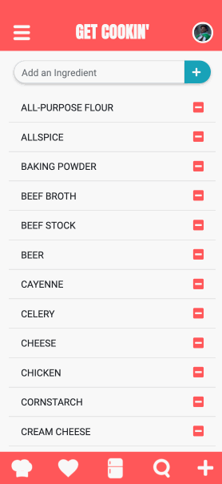
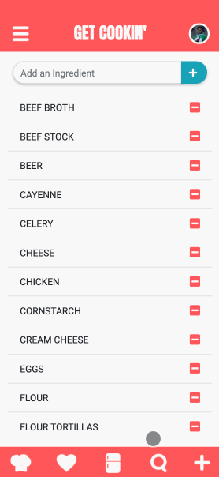
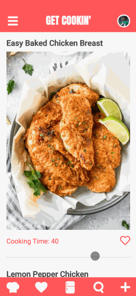
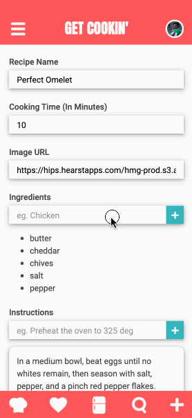
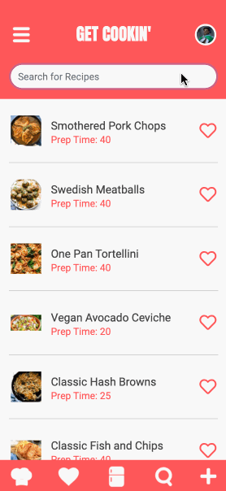

# Get Cookin'
A dynamic web application made for home cooks who want to use up the items in their fridge/freezer.

#### Live Site
Check out the live site here - [Get Cookin'](https://get-cookin.steventrancodes.com)

#### Technologies
* React.js
* React Router
* HTML5
* CSS3
* Bootstrap 4
* Node.js
* Express
* PostgreSQL
* AWS EC2
* Webpack 4

#### Features
* Users can view what recipes are available to cook
* Users can add  custom recipes to the app
* Users can update their in-app fridge
* Users can choose favorite recipes
* Users can search for all recipes available
* Users can create their own account
* Users can login to their account

#### Previews

##### Create User / Login


##### View, Add, and Delete Ingredients


##### View Recipes


##### View Favorite Recipes


##### Add a Recipe


##### Search All Recipes



#### System Requirements
* Node.js (10 or higher)
* NPM (6 or higher)
* PostgreSQL

#### Getting Started
1. Clone the repository and navigate to the directory.
```shell
git clone https://github.com/steventran815/get-cookin-app.git
cd get-cookin-app
```
2. Install all dependencies with NPM.
```shell
npm install
```
3. Initialize PostgreSQL server
```shell
sudo service postgresql start
```
4. Import existing example database.
```shell
npm run db:import
```
5. Start the project. Once your system finishes compiling, you can view the application by opening http://localhost:3000 in your browser.
```shell
npm run dev
```
